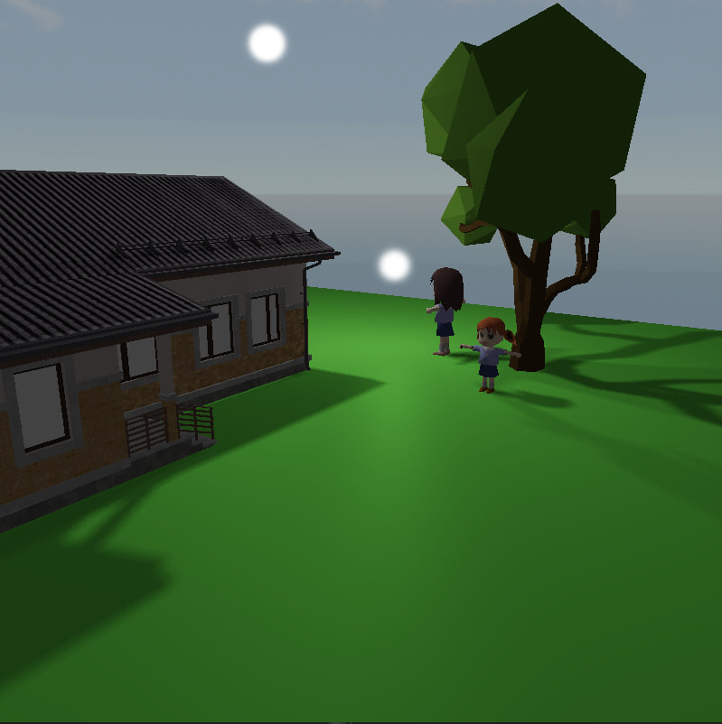
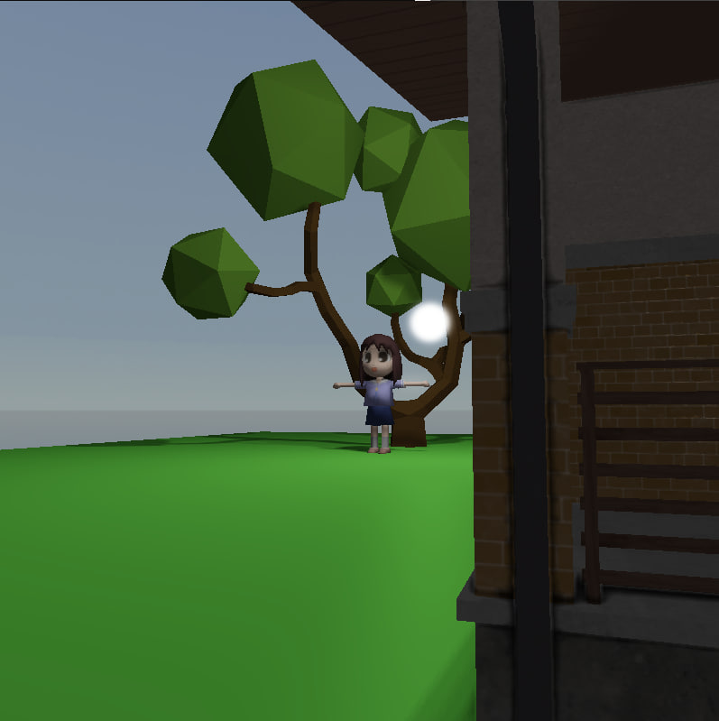
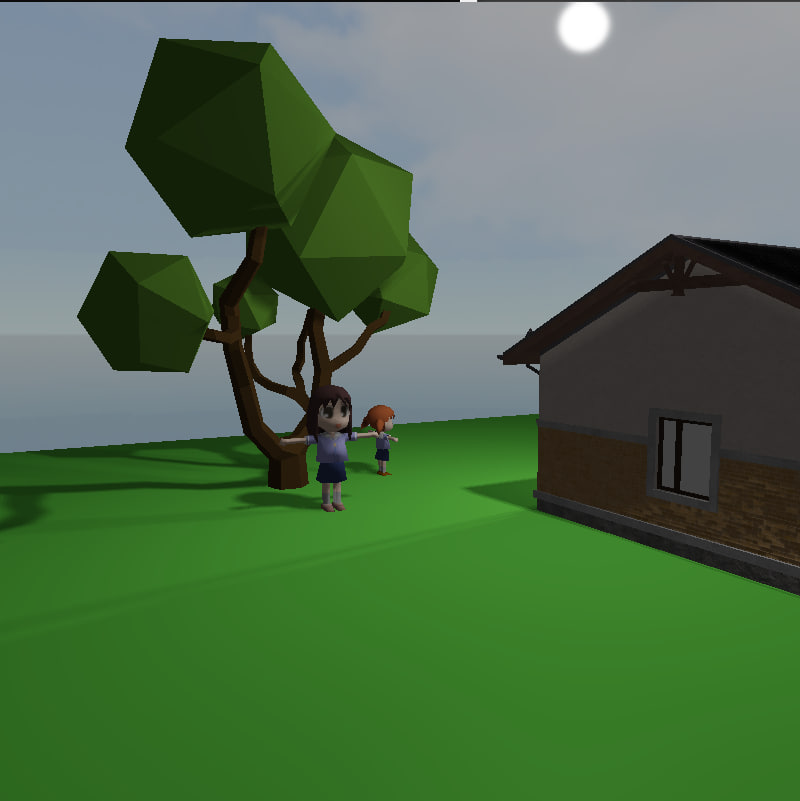

# XPEREngine

my own "game engine" on OpenGL

## Screenshots

## Features
- OpenGL-based graphics rendering
- SSAO
- Blinn-phong lighting model 
- Deferred shading 
- Light volumes 
- Normal mapping
- Shadow mapping
- Bloom and HDR
- Scene Graph
- Model loading

## Prerequisites
- CMake 
- C++17 compatible compiler
- Dependencies:
  - XPERMath
  - GLFW3
  - GLAD
  - GLM
  - Assimp (compatible with 5.4) 
  - stb_image
  - OpenGL 4.6
  - Gtest
